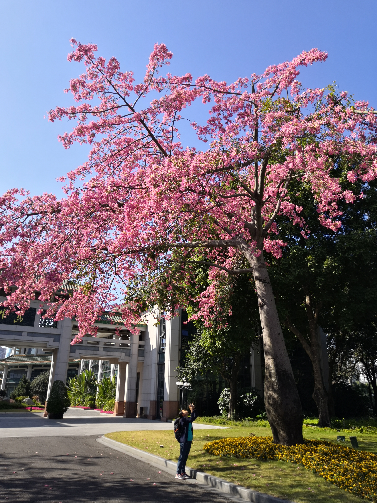

## My github pages projects

---

🔗[my daily note](https://jeffatoptics.github.io/jeffblog) &nbsp;&nbsp;&nbsp;&nbsp; 🔗[my zhihu notes](https://jeffatoptics.github.io/zhihu)  &nbsp;&nbsp;&nbsp;&nbsp; 🔗[my source repositories](https://github.com/jeffatoptics?tab=repositories&q=&type=source&language=&sort=)

---

{: height="400"}